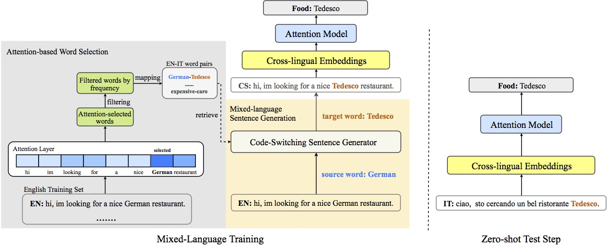

# Mixed-Language Training for Cross-lingual Task-oriented Dialogue Systems

 [](https://opensource.org/licenses/MIT)


This repository is for the AAAI-2020 oral paper: [Attention-Informed Mixed-Language Training for Zero-shot Cross-lingual Task-oriented Dialogue Systems](https://arxiv.org/abs/1911.09273)

This code has been written using PyTorch. If you use any source codes or ideas included in this repository for your work, please cite the following paper.
<pre>
@misc{liu2019attentioninformed,
    title={Attention-Informed Mixed-Language Training for Zero-shot Cross-lingual Task-oriented Dialogue Systems},
    author={Zihan Liu and Genta Indra Winata and Zhaojiang Lin and Peng Xu and Pascale Fung},
    year={2019},
    eprint={1911.09273},
    archivePrefix={arXiv},
    primaryClass={cs.CL}
}
</pre>

## Abstract
Recently, data-driven task-oriented dialogue systems have achieved promising performance in English. However, developing dialogue systems that support low-resource languages remains a long-standing challenge due to the absence of high-quality data. In order to circumvent the expensive and time-consuming data collection, we introduce Attention-Informed Mixed-Language Training (MLT), a novel zero-shot adaptation method for cross-lingual task-oriented dialogue systems. It leverages very few task-related parallel word pairs to generate code-switching sentences for learning the inter-lingual semantics across languages. Instead of manually selecting the word pairs, we propose to extract source words based on the scores computed by the attention layer of a trained English task-related model and then generate word pairs using existing bilingual dictionaries. Furthermore, intensive experiments with different cross-lingual embeddings demonstrate the effectiveness of our approach. Finally, with very few word pairs, our model achieves significant zero-shot adaptation performance improvements in both cross-lingual dialogue state tracking and natural language understanding (i.e., intent detection and slot filling) tasks compared to the current state-of-the-art approaches, which utilize a much larger amount of bilingual data.

## Data
We evaluate our approach on multilingual task-oriented natural language understanding dataset published by [Schuster et al. (2019)](https://www.aclweb.org/anthology/N19-1380.pdf) and dialogue state tracking published by [Mrksˇic ́ et al. (2017)](https://arxiv.org/pdf/1706.00374.pdf). We put these datasets in the data folder under this repository.

## Illustration of Attention-Informed Mixed-Language Traning


## Setup
We have already put the processed vocabulary, cross-lingual word embeddings and word pairs for dst and nlu tasks in the corresponding folders. To run this repository, you still need to install the required library dependencies.
- Install PyTorch (Tested in PyTorch 0.4.0 and Python 3.6)
- Install library dependencies

## Configuration
* ```--mix_train```: Use mixed-language training (MLT)
* ```--mapping_for_mix```: Path of word pairs mapping for MLT
* ```--emb_file_en```: Path of pretrained embeddings in English
* ```--emb_file_trans```: Path of pretrained embeddings in the transfer language
* ```--vocab_path_en```: Path of vocabulary in English
* ```--vocab_path_trans```: Path of vocabulary in the transfer language
* ```--mapping_for_mix```: Path of word pairs mapping for MLT
* ```--ontology_emb_file```: Path of ontology embedding file

## How to run
### DST Task
Zero-shot Adaptation for German
```
python main.py --exp_name dst_mlt_attn_de --bidirection --trans_lang de --mix_train --mapping_for_mix data/dst/dst_vocab/en2de_attn_for_mix.dict --emb_file_en data/dst/dst_emb/mix_embedding_en.attn.npy --emb_file_trans data/dst/dst_emb/embedding_de.npy --ontology_emb_file data/dst/dst_data/ontology_embeddings_de.npy --vocab_path_en data/dst/dst_vocab/mix_vocab.attn.en --vocab_path_trans data/dst/dst_vocab/vocab.de --weight_decay 1e-6
```
Zero-shot Adaptation for Italian
```
python main.py --exp_name dst_mlt_attn_it --bidirection --trans_lang it --mix_train --mapping_for_mix data/dst/dst_vocab/en2it_attn_for_mix.dict --emb_file_en data/dst/dst_emb/mix_embedding_en.attn.npy --emb_file_trans data/dst/dst_emb/embedding_it.npy --ontology_emb_file data/dst/dst_data/ontology_embeddings_it.npy --vocab_path_en data/dst/dst_vocab/mix_vocab.attn.en --vocab_path_trans data/dst/dst_vocab/vocab.it --weight_decay 1e-6
```

### NLU Task
Zero-shot Adaptation for Spanish
```
python main.py --exp_name nlu_mlt_attn_es --run_nlu --mix_train --bidirection --trans_lang es --batch_size 64 --emb_file_en data/nlu/nlu_emb/mix_embedding_en.attn.npy --emb_file_trans data/nlu/nlu_emb/embedding_es.npy --vocab_path_en data/nlu/nlu_vocab/mix_vocab.attn.en --vocab_path_trans data/nlu/nlu_vocab/vocab.es --mapping_for_mix data/nlu/nlu_vocab/en2es_20.attn.dict
```
Zero-shot Adaptation for Thai
```
python main.py --exp_name nlu_mlt_attn_th --run_nlu --mix_train --bidirection --trans_lang th --batch_size 64 --emb_file_en data/nlu/nlu_emb/mix_embedding_en.attn.clean.npy --emb_file_trans data/nlu/nlu_emb/embedding_th.clean.npy --vocab_path_en data/nlu/nlu_vocab/mix_vocab.attn.clean.en --vocab_path_trans data/nlu/nlu_vocab/vocab.clean.th --mapping_for_mix data/nlu/nlu_vocab/en2th_20.attn.dict --clean_txt
```
